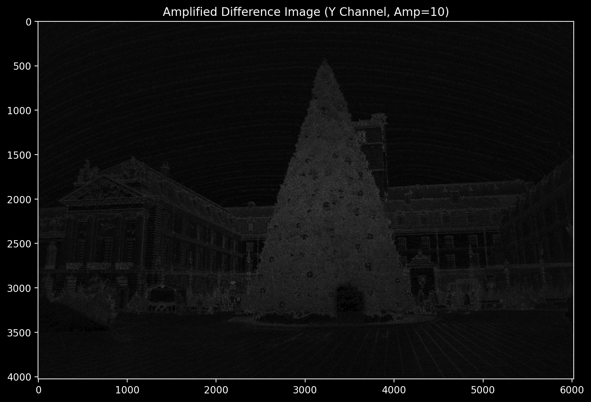
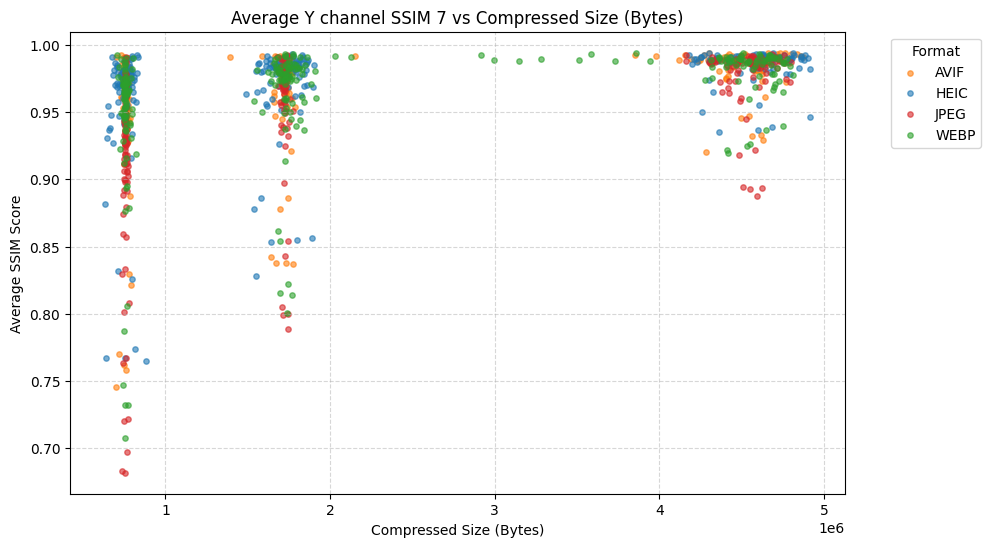
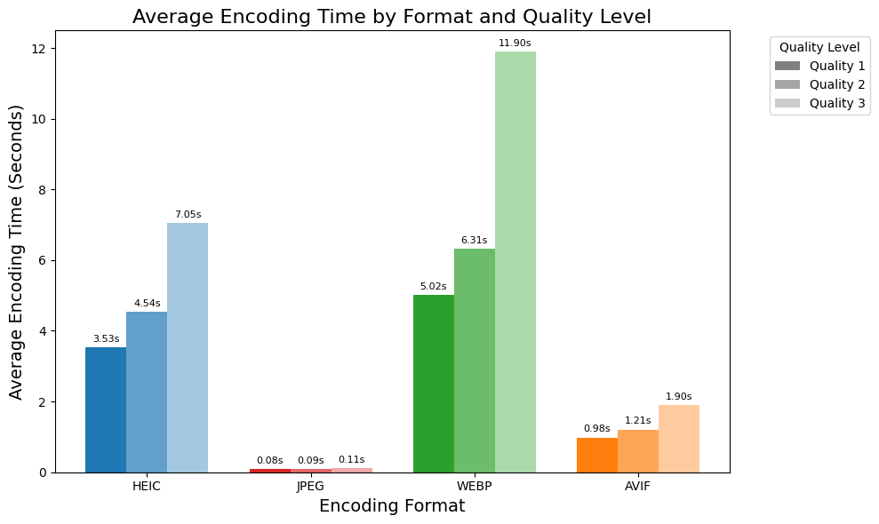

# Σύγκριση Αλγορίθμων Συμπίεσης Ψηφιακής Εικόνας

_Τελική εργασία του μαθήματος «Ψηφιακά Μέσα» στο ΠΜΣ Επιστήμη Υπολογιστών του ΟΠΑ_

##### Περιγραφή

Ο σκοπός αυτής της εργασίας ήταν η μελέτη, ανάλυση και σύγκριση διαφορετικών αλγορίθμων συμπίεσης εικόνας: JPEG, H.265 (HEIC), WebP, AVIF. Χρησιμοποιήθηκε ένα σύνολο πρωτότυπων, ασυμπίεστων εικόνων, οι οποίες συμπιέστηκαν σε διάφορους λόγους συμπίεσης με τους προαναφερθέντες αλγορίθμους. Στην συνέχεια για κάθε συμπιεσμένη εικόνα εξήχθησαν μετρήσεις (MSE, PSNR, SSIM, VMAF), ιστογράμματα και διαγράμματα διαφορών συγκριτικές με την αρχική εικόνα. 

Αναλυτική γραπτή αναφορά εργασίας: [`REPORT.pdf`](https://github.com/DimK19/middle-out/blob/main/docs/REPORT.pdf).

##### Ενδεικτικές εικόνες και αποτελέσματα

 

